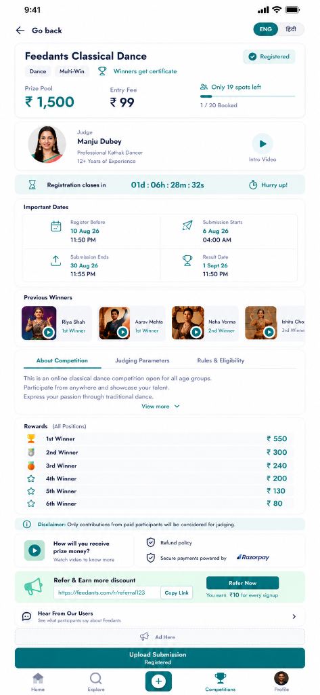

# Feedants Competition Platform — Full-Stack Module

[](https://github.com/stevonmachado00-cmd/FEEDANTS)
[](https://expo.dev)
[](https://nodejs.org)
[](https://mongodb.com)
[](https://docker.com)

A production-grade, full-stack implementation of the **Feedants Competition Details Module** built with an atomic concurrency model, pixel-perfect design matching, and real-world interactive capabilities.

<p align="center">
  
</p>

---

## 📑 Table of Contents
1. [Key Features & Highlights](#-key-features--highlights)
2. [Tech Stack](#-tech-stack)
3. [Architecture & Project Structure](#-architecture--project-structure)
4. [Real-World Meaningful Interactions](#-real-world-meaningful-interactions)
5. [Concurrency Safety & Atomic Spot Control](#-concurrency-safety--atomic-spot-control)
6. [Security Suite & Reliability](#-security-suite--reliability)
7. [API Reference](#-api-reference)
8. [Installation & Local Setup](#-installation--local-setup)
9. [100% Free Cloud Deployment Guide](#-100-free-cloud-deployment-guide)
10. [Docker & Containerization](#-docker--containerization)

---

## ✨ Key Features & Highlights

- **Pixel-Perfect Screen Replication:** Exact reproduction of the Feedants Classical Dance competition layout, typography, badges, color palettes, and component hierarchy.
- **Atomic Spot Decrement:** Zero-overbooking guarantee utilizing MongoDB atomic `$inc` operators with conditional expressions.
- **Dynamic Sticky CTA:** Intelligently transforms across competition states:
  - *Guest:* Prompts sign-in / registration
  - *Unregistered:* `Register Now • ₹99` with multi-method checkout
  - *Registered:* `Upload Performance` with file picker dialog
  - *Submitted:* `View / Edit Submission`
  - *Closed / Full:* Disabled state indicator
- **Multi-lingual Support:** Instant one-click toggle between English (`ENG`) and Hindi (`हिंदी`).
- **Live Real-time Countdown:** Live ticking countdown to registration deadlines with dynamic "Hurry up!" alerts.
- **Unified Full-Stack Runtime:** Statically compiled Expo Web bundle served directly by the Express backend on a single port (`PORT=5000`), completely eliminating cross-origin CORS friction in production.

---

## 🚀 Tech Stack

### Frontend
- **Framework:** React Native (Expo SDK 52) with `react-native-web`
- **State Management:** Redux Toolkit (`@reduxjs/toolkit`, `react-redux`)
- **Navigation:** React Navigation v6 Stack & Tab architecture
- **Storage:** Cross-platform secure adapter (`expo-secure-store` for Native, `localStorage` for Web)
- **Media Player:** HTML5 native video player with custom cinema modal controls
- **Animations & Icons:** Smooth layout transitions, Lucide/Ionicons style iconography

### Backend
- **Runtime:** Node.js (v20+) & Express.js
- **Database:** MongoDB with Mongoose ODM
- **Real-Time Stream:** Socket.IO for live spots broadcast and competition room streams
- **File Upload:** Multer handling media uploads with size and mime-type filters
- **Validation:** Joi request body schema validation

### Security Stack
- **Authentication:** Stateless dual JWT tokens (15m access token + 7d rotating refresh token)
- **Password Hashing:** `bcryptjs` with 12 salt rounds
- **Injection Protection:** `express-mongo-sanitize` (blocks NoSQL query selector injection attacks)
- **XSS Guard:** `xss-clean` sanitizing user inputs against cross-site scripting
- **Rate Limiting:** `express-rate-limit` protecting against brute-force auth and API scraping
- **HTTP Hardening:** `helmet` with custom media permissions for external CDNs (Unsplash, Google Cloud)

---

## 📁 Architecture & Project Structure

```text
feedants-competition/
├── backend/
│   ├── config/
│   │   ├── db.js                     # MongoDB connection with resilient fallback
│   │   └── jwt.js                    # JWT access & refresh secrets
│   ├── controllers/
│   │   ├── authController.js         # Signup, login, rotating token refresh, logout
│   │   ├── competitionController.js  # Live competition fetch & lifecycle status
│   │   ├── registrationController.js # Concurrency-safe atomic registration
│   │   └── submissionController.js   # Media upload & submission review
│   ├── middleware/
│   │   ├── authMiddleware.js         # Bearer token verification route guard
│   │   ├── errorHandler.js           # Centralized exception handler
│   │   ├── rateLimiter.js            # General (100/15min) & Auth (10/15min) limiters
│   │   ├── securityMiddleware.js     # Helmet, CORS, input sanitization
│   │   ├── upload.js                 # Multer media storage configuration
│   │   └── validateRequest.js        # Joi schema validation middleware
│   ├── models/
│   │   ├── Competition.js            # Competition schema + remainingSpots virtual
│   │   ├── Registration.js           # Registration schema with unique compound index
│   │   ├── Submission.js             # User performance submissions schema
│   │   └── User.js                   # User auth & referral code generator
│   ├── routes/
│   │   ├── authRoutes.js             # /api/auth endpoints
│   │   ├── competitionRoutes.js      # /api/competitions endpoints
│   │   ├── registrationRoutes.js     # /api/competitions/:id/register
│   │   └── submissionRoutes.js       # /api/competitions/:id/submissions
│   ├── seed/
│   │   └── seedData.js               # Database seeder matching the exact design
│   ├── package.json
│   └── server.js                      # Unified Express & Socket.io server
│
├── frontend/
│   ├── dist/                         # Statically compiled production web bundle
│   ├── src/
│   │   ├── api/
│   │   │   └── competitionApi.js      # Adaptive API client (Dev / Web / Mobile)
│   │   ├── components/
│   │   │   ├── AdBanner.js            # Verified partner perk card (SoundPro 20% OFF)
│   │   │   ├── AuthModal.js           # Login & Registration authentication modal
│   │   │   ├── BottomNavBar.js        # Persistent 5-tab mobile navigation bar
│   │   │   ├── CompetitionsModal.js   # Live multi-competition explorer & switcher
│   │   │   ├── CountdownBanner.js     # Live countdown timer hook integration
│   │   │   ├── DetailsTabs.js         # About / Judging / Rules tabs with text expander
│   │   │   ├── Header.js              # Back action + language switcher + profile badge
│   │   │   ├── HeroCard.js            # Title, tags, prize pool, fee & spots ratio
│   │   │   ├── ImportantDates.js      # 2x2 grid + 1-click Google Calendar sync
│   │   │   ├── JudgeCard.js           # Judge credentials & intro video trigger
│   │   │   ├── ParticipationPaymentModal.js # Full checkout with UPI, Cards, NetBanking
│   │   │   ├── PreviousWinners.js     # Winner carousel with performance playback
│   │   │   ├── ProfileModal.js        # User statistics, registered spots & submissions
│   │   │   ├── ReferralBanner.js      # Live referral link & 1-click social sharing
│   │   │   ├── RefundPolicyModal.js   # 100% Refund & Razorpay Escrow terms modal
│   │   │   ├── RewardsTable.js        # Tiered prize breakdown (1st to 6th rank)
│   │   │   ├── SpotsProgressBar.js    # Visual progress bar of booked vs total spots
│   │   │   ├── StickyActionBar.js     # State-reactive bottom CTA button
│   │   │   ├── SubmissionModal.js     # Native file picker & performance submission
│   │   │   ├── TestimonialsModal.js   # Verified participant reviews & social proof
│   │   │   ├── TrustBadges.js         # FAQ video trigger & refund policy links
│   │   │   ├── UserTestimonials.js    # Community reviews card
│   │   │   └── VideoModal.js          # HTML5 cinema video playback dialog
│   │   ├── hooks/
│   │   │   └── useCountdown.js        # High-accuracy interval countdown hook
│   │   ├── screens/
│   │   │   └── CompetitionDetailsScreen.js # Master container coordinating all modules
│   │   ├── store/
│   │   │   ├── index.js               # Redux store
│   │   │   └── slices/                # competitionSlice.js, userSlice.js
│   │   └── utils/
│   │       ├── colors.js              # Feedants design color tokens
│   │       ├── fonts.js               # Typography definitions
│   │       ├── helpers.js             # Currency & date formatters
│   │       └── translations.js        # English / Hindi localization dictionaries
│   ├── App.js
│   ├── app.json
│   └── package.json
│
├── docs/                             # Media assets and screenshots
├── Dockerfile                        # Multi-stage container build
├── docker-compose.yml                # Full stack container orchestration
├── render.yaml                       # 1-click cloud blueprint for Render
├── Procfile                          # Process definition for Railway / Heroku
├── vercel.json                       # Static SPA routing configuration
├── package.json                      # Root scripts for building and deployment
└── README.md
```

---

## 🎯 Real-World Meaningful Interactions

Every interactive element in the frontend provides realistic, production-ready utility:

1. **Google Calendar Event Integration:**
   Clicking **"📅 Add Deadlines to Google Calendar"** in the *Important Dates* section constructs a pre-filled Google Calendar event URL with the competition title, submission deadline, and evaluation dates.
2. **Native Media File Upload:**
   Clicking **"Upload Performance"** triggers the browser's native file picker (`<input type="file" accept="video/*,audio/*" />`), displays the attached file name and size in MB, and tracks progress during upload.
3. **HTML5 Cinema Video Player:**
   Clicking **"▶ Intro Video"**, winner performance clips, or the prize FAQ video launches an HTML5 video player with native controls (seek, volume, pause/play, time elapsed, and fullscreen).
4. **Verified Participant Reviews Modal:**
   Clicking **"Hear From Our Users"** opens a modal featuring 4 verified winner stories, 4.9/5 satisfaction metrics, and ₹8.5L+ disbursed badges.
5. **100% Refund & Fair Play Policy Modal:**
   Clicking **"Refund policy"** displays escrow protection terms, automatic 24-48h cancellation refunds, pre-submission withdrawal rules, and support contact details.
6. **Live Multi-Channel Referral Link:**
   Generates a dynamic referral URL based on the current domain (`?ref=username&comp=id`) with 1-click copy feedback and instant share triggers for WhatsApp, Telegram, X, and Email.
7. **Complete Payment Gateway Simulation:**
   Tapping **"Book Spot & Pay Entry Fee"** opens a multi-tab payment modal supporting UPI (GPay, PhonePe, Paytm, BHIM), Credit/Debit Cards, NetBanking, and Wallets with receipt confirmations.
8. **User Profile & Registration Tracking:**
   Clicking **Profile** on the bottom navigation displays enrolled competitions, total fees paid, active submission statuses, and account settings.

---

## ⚡ Concurrency Safety & Atomic Spot Control

To prevent race conditions and overbooking when hundreds of users register simultaneously for the final spot, the application uses MongoDB's atomic `findOneAndUpdate` with a query-level precondition:

```javascript
// backend/controllers/registrationController.js
const updatedCompetition = await Competition.findOneAndUpdate(
  {
    _id: competitionId,
    status: 'registration_open',
    $expr: { $lt: ['$bookedSpots', '$totalSpots'] } // Guarantees bookedSpots < totalSpots
  },
  {
    $inc: { bookedSpots: 1 } // Atomic increment at database engine level
  },
  { new: true }
);

if (!updatedCompetition) {
  return res.status(409).json({
    success: false,
    message: 'Competition is either fully booked or registration is closed.'
  });
}
```

- **Compound Unique Index:** `RegistrationSchema.index({ userId: 1, competitionId: 1 }, { unique: true })` prevents duplicate registrations by the same user.

---

## 🛡️ Security Suite & Reliability

- **Stateless Dual-Token JWT:** Short-lived access tokens (15m) stored in memory / SecureStore, paired with 7-day rotating refresh tokens stored hashed in the database.
- **NoSQL Injection Prevention:** `express-mongo-sanitize` strips out `$` and `.` characters from user input bodies and query params.
- **XSS Sanitization:** `xss-clean` filters HTML tags and script injection payloads.
- **Rate Limiting:** General endpoints are capped at 100 requests / 15 min; authentication routes are capped at 10 requests / 15 min.
- **Error Handling Middleware:** Global exception handler sanitizes error stacks in production while returning standardized error envelopes.

---

## 📡 API Reference

### Health
- `GET /api/health` — Service uptime and status check.

### Competitions
- `GET /api/competitions/:id` — Retrieve full competition details with virtual `remainingSpots`.
- `GET /api/competitions/:id/status` — Get computed lifecycle status based on current timestamps.

### Authentication
- `POST /api/auth/signup` — Create a new account with email, name, password (returns access & refresh tokens).
- `POST /api/auth/login` — Authenticate user and issue tokens.
- `POST /api/auth/refresh` — Rotate and issue a fresh access token.
- `POST /api/auth/logout` — Revoke active refresh token.

### Registration & Submissions
- `POST /api/competitions/:id/register` *(Protected)* — Atomically book a competition spot.
- `GET /api/users/me/registration/:id` *(Protected)* — Check current user's registration status.
- `POST /api/competitions/:id/submissions` *(Protected, Multipart)* — Upload video/audio entry or provide cloud link.
- `GET /api/competitions/:id/submissions/me` *(Protected)* — Retrieve user's submission.

---

## 🛠️ Installation & Local Setup

### Prerequisites
- Node.js v18+ 
- MongoDB running locally or a MongoDB Atlas URI

### 1. Clone the Repository
```bash
git clone https://github.com/stevonmachado00-cmd/FEEDANTS.git
cd FEEDANTS
```

### 2. Install Dependencies
```bash
npm run install:all
```

### 3. Build & Run in Production Mode (Unified Single-Port)
```bash
npm run build
npm start
```
The server will start on `http://localhost:5000` serving both the Web application and the REST API.

### 4. Run in Development Mode
In terminal 1:
```bash
npm run dev:backend
```
In terminal 2:
```bash
npm run dev:frontend
```

---

## 🌐 100% Free Cloud Deployment Guide

Deploy this project on **Render** (Node Web Service) and **MongoDB Atlas** completely free:

### 1. Set up Free Database (MongoDB Atlas)
1. Sign up at [mongodb.com/atlas](https://www.mongodb.com/atlas/database) and create a free **M0 Shared Cluster**.
2. Add `0.0.0.0/0` under Network Access.
3. Create a database user and copy your connection string:
   ```text
   mongodb+srv://username:<password>@cluster0.abcde.mongodb.net/feedants?retryWrites=true&w=majority
   ```

### 2. Deploy to Render (Free Web Service)
1. Go to [render.com](https://render.com) and click **New +** $\rightarrow$ **Web Service**.
2. Connect your GitHub repository (`FEEDANTS`).
3. Set the following options:
   - **Build Command:** `npm run build`
   - **Start Command:** `npm start`
   - **Instance Type:** `Free`
4. Add Environment Variables:
   - `NODE_ENV`: `production`
   - `MONGO_URI`: *(your MongoDB Atlas URI from step 1)*
   - `JWT_ACCESS_SECRET`: `feedants_access_secret_production_2026`
   - `JWT_REFRESH_SECRET`: `feedants_refresh_secret_production_2026`
   - `ALLOWED_ORIGINS`: `*`
5. Click **Deploy Web Service**!

Render provides a free public HTTPS domain (e.g. `https://feedants.onrender.com`).

---

## 🐳 Docker & Containerization

Run the application and database with a single command using Docker:

```bash
docker-compose up --build -d
```
Access the application at `http://localhost:5000`.

---

## 📄 License
This project is developed for the Feedants Full Stack Internship Assignment.
